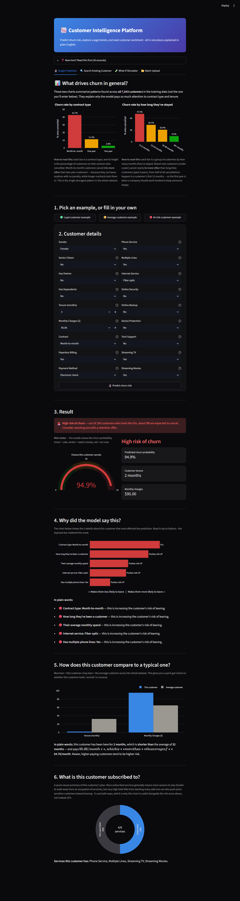
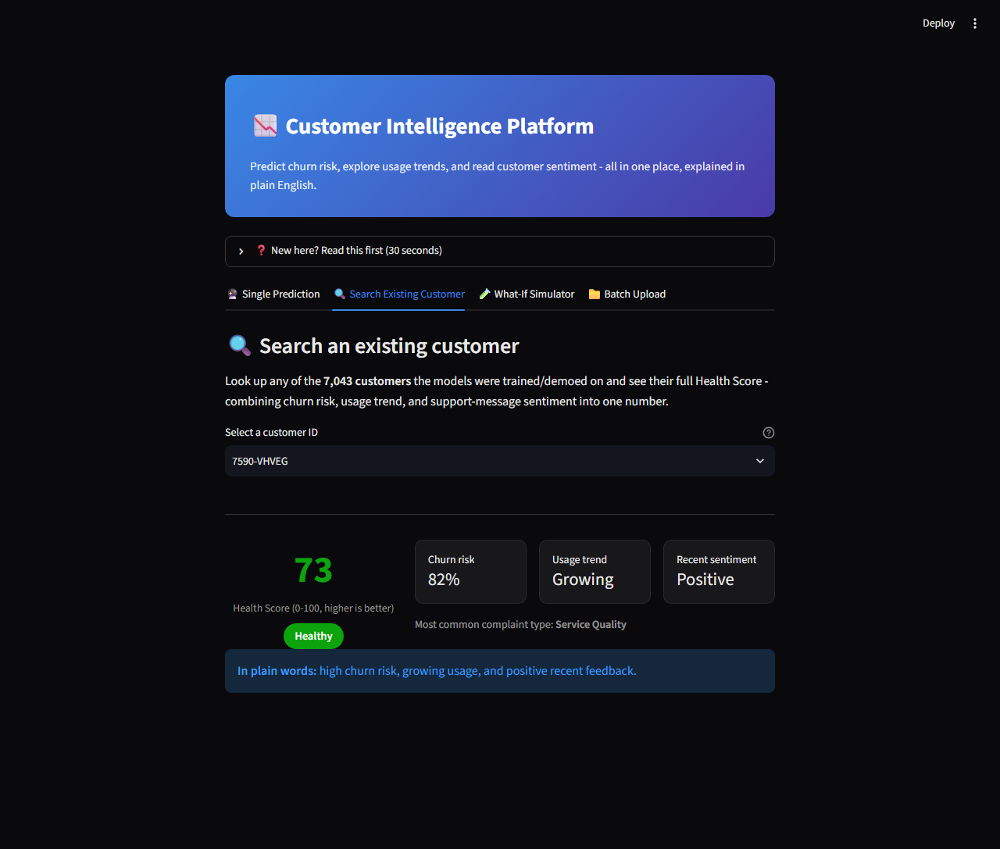
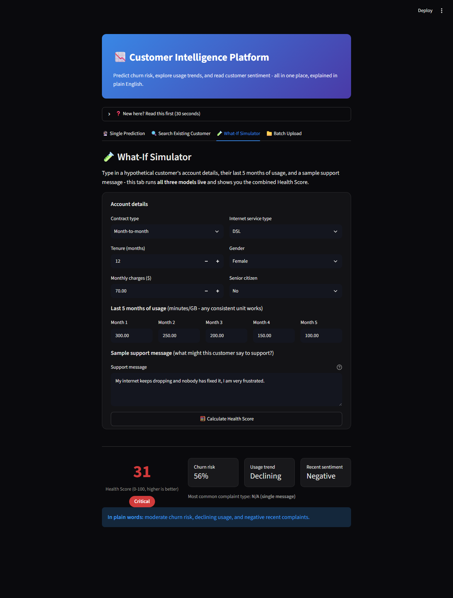
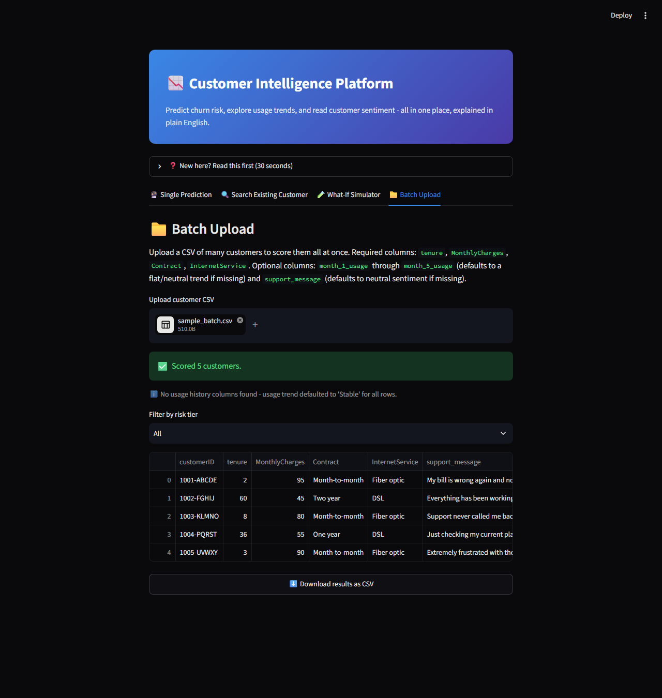

# Customer Intelligence Platform

An end-to-end machine learning project that started as a churn prediction
model and grew into a full **Customer Intelligence Platform** — combining a
production-grade churn classifier, a deep learning usage-trend model, and an
NLP sentiment layer into one Health Score, served through an interactive
Streamlit app with three ways to use it.

**Live demo:** [churn-prediction-app-8ioaenzecxexkcskdmzvxc.streamlit.app](https://churn-prediction-app-8ioaenzecxexkcskdmzvxc.streamlit.app/)

## Screenshots

| Single Prediction | Search Existing Customer |
|---|---|
|  |  |

| What-If Simulator | Batch Upload |
|---|---|
|  |  |

## Overview

This project walks the full lifecycle of a real classification problem:
raw data → cleaning → exploratory analysis → feature engineering → model
comparison → interpretation → a deployed, user-facing app. It's built as a
portfolio piece to demonstrate practical, business-aware machine learning —
not just model accuracy, but *why* the model makes the calls it does and
what a business should do about it.

## Business Problem

Acquiring a new telecom customer costs far more than retaining an existing
one, but a retention team can't call every customer. This project scores
each customer's churn risk and explains the top contributing factors, so
limited retention budget (discounts, contract offers, proactive outreach)
can be targeted at the customers who are both **likely to leave** and
**worth trying to save**.

Because a missed churner (lost recurring revenue) is costlier than a false
alarm (an unnecessary retention offer), the project explicitly optimizes for
**recall** on the churn class rather than raw accuracy — see
[Model Performance](#model-performance) below.

## Architecture: from churn model to Customer Intelligence Platform

The original project (Phases 1-7 below) is a complete, standalone churn
prediction pipeline trained entirely on **real data** — nothing about it
changed. On top of that, four more layers were added to combine churn risk
with two additional signals into one number a retention team can act on:

```
Data Science (cleaning, EDA)
        ↓
Machine Learning  →  churn risk score (XGBoost, real data, AUC 0.839)
        ↓
Deep Learning     →  usage-trend classifier (LSTM, synthetic usage data)
        ↓
NLP               →  sentiment analysis (pretrained DistilBERT, synthetic tickets)
        ↓
Combined Health Score (0-100) + risk tier (Critical / At-Risk / Healthy)
```

> ⚠️ **Honesty note on data:** the real Telco dataset only contains
> account-level snapshot data (contract, charges, services) — it has **no**
> month-by-month usage history and **no** customer support tickets. To build
> and demo the deep learning and NLP layers, `generate_synthetic_data.py`
> fabricates both, correlated with each customer's *real* churn status so
> the synthetic signals behave the way real ones plausibly would (declining
> usage and angrier tickets for customers who actually churned) rather than
> being random noise. **The churn model itself (the ML layer) is trained on
> 100% real data** - only the DL and NLP layers use synthetic input.

**Framework note:** the usage-trend model is an LSTM built in **PyTorch**,
not TensorFlow/Keras as originally planned — TensorFlow has no published
build for Python 3.14 (this project's interpreter) at the time of writing.
Same architecture and task, different framework. See
`train_usage_trend_model.py` for details.

**Combined Health Score:** `combine_health_score.py` weights churn risk
highest (it's the single most predictive signal, backed by a model trained
specifically for this task) and treats usage trend and sentiment as
modifiers that can shift the score by up to 15 points each — enough to
matter, not enough to override a strong churn signal in most cases (in
testing, only ~3% of customers with >70% churn risk got pulled all the way
into the "Healthy" tier by strongly positive secondary signals).

## Dataset

[IBM Telco Customer Churn dataset](https://www.kaggle.com/datasets/blastchar/telco-customer-churn)
(via Kaggle / IBM sample data) — **7,043 customers, 21 features** covering
demographics, account details (contract, tenure, billing), and subscribed
services (phone, internet, streaming, security add-ons).

## Tools & Libraries

| Category | Tools |
|---|---|
| Data manipulation | pandas, numpy |
| Machine learning | scikit-learn (Logistic Regression, Random Forest), XGBoost |
| Deep learning | PyTorch (LSTM usage-trend classifier) |
| NLP | Hugging Face Transformers (pretrained DistilBERT sentiment model) |
| Visualization | matplotlib, seaborn, Plotly (interactive charts in-app) |
| Model interpretation | SHAP |
| App / deployment | Streamlit, Streamlit Community Cloud |
| Persistence | joblib |

## Pipeline

**Original churn pipeline (real data):**

| Phase | Script | What it does |
|---|---|---|
| 1 | `churn_phase1_eda.py` | Initial data loading, shape, dtypes, missing values, class balance |
| 2 | `churn_phase2_cleaning.py` | Fixes `TotalCharges` dtype, handles missing values, dedupes, standardizes categories |
| 3 | `churn_phase3_eda.py` | Visual EDA — churn by contract, tenure, correlation heatmap, charges distribution |
| 4 | `churn_phase4_features.py` | Feature engineering (tenure bins, service count, spend ratio, contract-term flag) |
| 5 | `churn_phase5_models.py` | Trains & compares Logistic Regression, Random Forest, XGBoost |
| 6 | `churn_phase6_evaluation.py` | ROC/AUC, feature importance, SHAP explanations |
| 7 | `train_and_save_model.py` | Trains & serializes the final XGBoost pipeline used everywhere else |

**Customer Intelligence Platform extension (synthetic DL/NLP inputs, real churn model):**

| Script | What it does |
|---|---|
| `generate_synthetic_data.py` | Fabricates 5-month usage history + support tickets, correlated with real churn status |
| `train_usage_trend_model.py` | Trains a PyTorch LSTM to classify usage as Declining/Stable/Growing (92.1% accuracy vs. 69.8% naive baseline) |
| `train_sentiment_model.py` | Scores support tickets with a pretrained DistilBERT sentiment model + keyword-based complaint categories |
| `combine_health_score.py` | Weights churn risk, usage trend, and sentiment into one 0-100 Health Score + risk tier |
| `app.py` | Streamlit app - 4 tabs: Single Prediction, Search Existing Customer, What-If Simulator, Batch Upload |

## Key Findings

- **Contract type is the strongest churn driver.** Month-to-month customers
  churn at **42.7%**, versus **11.3%** for one-year contracts and just
  **2.8%** for two-year contracts — an ~15x gap between the least and most
  committed customers.
- **Churn is front-loaded.** Customers with 0–12 months of tenure churn at
  **47.4%**, dropping to **9.5%** for customers past 49 months. Over **55%**
  of all churn happens within a customer's first year.
- **Price sensitivity is real.** Churned customers have a higher median
  monthly bill (**$79.65**) than retained customers (**$64.43**), pointing
  to a value gap on expensive plans.

*(See `churn_phase3_eda.py` for the full charts and per-chart interpretation.)*

## Model Performance

Evaluated on a stratified 80/20 train/test split, with class weighting to
correct for the dataset's ~73/27 class imbalance:

| Model | Accuracy | Precision | Recall | F1 |
|---|---|---|---|---|
| Logistic Regression | 74.2% | 50.9% | **79.1%** | 0.620 |
| Random Forest | 76.3% | 54.6% | 63.6% | 0.588 |
| **XGBoost (deployed)** | 75.1% | 52.1% | 77.3% | **0.622** |

**XGBoost AUC: 0.839** — meaning the model reliably ranks likely churners
above likely stayers across virtually any decision threshold.

XGBoost was chosen for deployment over Random Forest despite similar
accuracy because it recalls **77.3%** of actual churners versus Random
Forest's 63.6% — given that missing a churner is the costlier mistake for
this business problem, the model that catches more of them wins even at a
similar F1.

**Top predictors** (via feature importance + SHAP): **Contract type**
(by far the largest driver), **Internet service type** (Fiber optic
customers churn more), and **tenure** — confirming the EDA findings above.
Customers who are new, on month-to-month contracts, and on fiber internet
are the highest-risk segment.

## The App

The Streamlit app (`app.py`) has four tabs:

1. **🔮 Single Prediction** — the original churn-only predictor. Enter a
   customer's details (or click a Loyal/Average/At-risk example button) and
   get a churn probability gauge, a SHAP bar chart of the top 5 factors
   driving that specific prediction (in plain English, not raw feature
   names), a comparison to the average customer, and a breakdown of
   subscribed services.
2. **🔍 Search Existing Customer** — look up any of the 7,043 training
   customers by ID and see their full Health Score: churn risk, usage
   trend, sentiment, complaint category, and a plain-language explanation.
3. **🧪 What-If Simulator** — type in a hypothetical customer's account
   details, their last 5 months of usage, and a sample support message, and
   get a live Health Score computed by running all three models in real
   time.
4. **📁 Batch Upload** — upload a CSV of many customers, score them all at
   once (churn model + usage-trend model + sentiment model, run per row),
   filter by risk tier, and download the results.

## Running Locally

**Requirements:** Python 3.10+ (this project was built and tested on 3.14)
and the packages in `requirements.txt` (Streamlit, pandas, numpy,
scikit-learn, XGBoost, SHAP, Plotly, joblib, PyTorch, Transformers).

```bash
git clone https://github.com/Faizan4356/churn-prediction-app.git
cd churn-prediction-app
pip install -r requirements.txt
```

Download the [Telco Customer Churn CSV](https://www.kaggle.com/datasets/blastchar/telco-customer-churn)
and place it in this folder as `WA_Fn-UseC_-Telco-Customer-Churn.csv`, then:

```bash
# 1. Original churn pipeline
python churn_phase1_eda.py
python churn_phase2_cleaning.py
python churn_phase3_eda.py
python churn_phase4_features.py
python churn_phase5_models.py
python churn_phase6_evaluation.py
python train_and_save_model.py

# 2. Customer Intelligence Platform extension - run in this exact order,
#    each step depends on the previous one's output
python generate_synthetic_data.py       # -> usage_history.csv, support_tickets.csv
python train_usage_trend_model.py       # -> usage_trend_model.pt, usage_trend_labels.joblib
python train_sentiment_model.py         # -> customer_sentiment_scores.csv
python combine_health_score.py          # -> customer_health_scores.csv

# 3. Verify everything end-to-end (30 automated checks)
python test_customer_intelligence_platform.py

# 4. Launch the app
streamlit run app.py
```

The app will be available at `http://localhost:8501`.

> The repo already ships with a trained `churn_model.joblib` /
> `churn_model_meta.joblib`, so `streamlit run app.py` alone gets you the
> **Single Prediction** tab immediately. The other three tabs need the
> Customer Intelligence Platform files above generated first.

**A performance note if you hit a hang:** on some environments,
`transformers`' high-level `pipeline()` wrapper can hang indefinitely even
on small text batches (observed on Python 3.14 + PyTorch 2.10 on Windows).
Both `train_sentiment_model.py` and `app.py` work around this by calling
the tokenizer and model directly instead of through `pipeline()` — if you
fork this and add NLP code elsewhere, prefer that same direct pattern.

## Project Structure

```
├── churn_phase1_eda.py               # Data loading & understanding
├── churn_phase2_cleaning.py          # Data cleaning
├── churn_phase3_eda.py               # Exploratory data analysis
├── churn_phase4_features.py          # Feature engineering
├── churn_phase5_models.py            # Model training & comparison
├── churn_phase6_evaluation.py        # Evaluation & SHAP interpretation
├── train_and_save_model.py           # Trains & serializes the final churn model
├── churn_model.joblib                # Serialized trained churn pipeline
├── churn_model_meta.joblib           # Column metadata + averages for the app
│
├── generate_synthetic_data.py        # Synthetic usage history + support tickets
├── usage_trend_model_def.py          # Shared PyTorch LSTM class definition
├── train_usage_trend_model.py        # Trains the usage-trend LSTM
├── usage_trend_model.pt              # Trained LSTM weights
├── usage_trend_labels.joblib         # Trend label encoder
├── train_sentiment_model.py          # NLP sentiment + complaint category scoring
├── combine_health_score.py           # Combines all 3 signals into a Health Score
├── test_customer_intelligence_platform.py  # End-to-end verification (30 checks)
│
├── app.py                            # Streamlit app (4 tabs)
├── .streamlit/config.toml            # App color theme
└── requirements.txt
```
